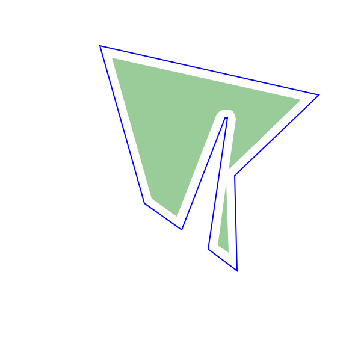
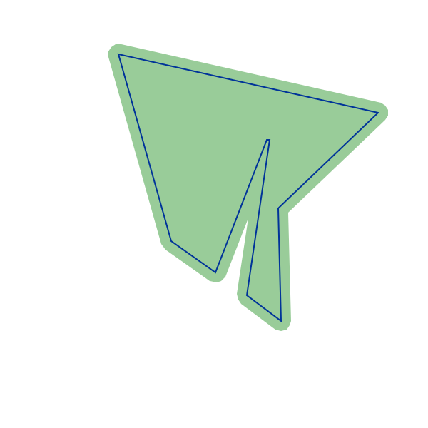
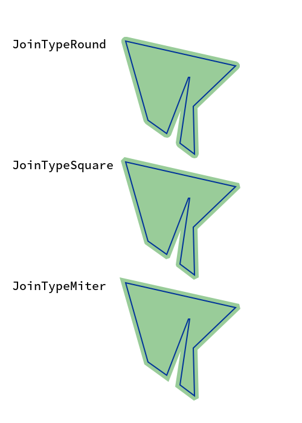

# Clipper.jl

Clipper.jl is a Julia wrapper for [Angus Johnson's Clipper library (ver. 6.4.2)](http://www.angusj.com/delphi/clipper.php).

It can be used for the following two tasks:
- offsetting a polygon 
- compute boolean operations between two or more polygons

## General description of a polygon

A polygon consists of a list of vertices $v_1, \dots, v_n$ such that $v_1$ is connected to $v_2$ and $v_n$. $v_i$ is connected to $v_{i-1}$ and $v_{i+1}$.
All functionality in Clipper only works with vertices that have discrete coordinates. Therefore the struct [`IntPoint`](@ref) is used.
Points which consist of two floating point coordinates can however be easily converted using the [`IntPoint`](@ref) method.

```julia
p = (1.1, 2.1)
ip = IntPoint(p..., 1, 3) # [110, 210]
```

Here `1` is the magnitude and `3` is the number of significant digits.

There is also the function [`tofloat`](@ref) which can be used to convert a [`IntPoint`](@ref) back to the floating point coordinates.

```julia
tofloat(ip, 1, 3) # (1.1, 2.1)
```

Using broadcasting you can also easily convert several points like a whole polygon this way:

```julia
ps = rand(100, 2) 
ips = IntPoint.(ps[:,1], ps[:,2], 1, 3)
```

and back
```julia
tofloat.(ips, 1, 3)
```

## Offsetting a polygon

[Original Clipper documentation](http://www.angusj.com/delphi/clipper/documentation/Docs/Units/ClipperLib/Classes/ClipperOffset/_Body.htm).

A polygon can be offset (inflated/deflated) in the following way using Clipper.jl:


```julia
polygon = IntPoint[]
push!(polygon, IntPoint(348,257))
push!(polygon, IntPoint(364,148))
push!(polygon, IntPoint(362,148))
push!(polygon, IntPoint(326,241))
push!(polygon, IntPoint(295,219))
push!(polygon, IntPoint(258,88))
push!(polygon, IntPoint(440,129))
push!(polygon, IntPoint(370,196))
push!(polygon, IntPoint(372,275))

co = ClipperOffset()
add_path!(co, polygon, JoinTypeRound, EndTypeClosedPolygon)
offset_polygons = execute(co, -7.0)
```

```@meta
# using Luxor
# fpolygon = Point.(tofloat.(polygon, 3,3))
# foffset_polygons = [Point.(tofloat.(offset_polygon, 3,3)) for offset_polygon in offset_polygons]
# @png begin
#     translate(-650, -400)
#     scale(2)
#     sethue("blue")
#     poly(fpolygon, :stroke, close=true)
#     sethue("green")
#     setopacity(0.4)
#     poly.(foffset_polygons, :fill, close=true)
# end 600 600 "offset_in.png"
```


In the image above the blue polygon is the initial polygon and by offsetting it two polygons are created
which are drawn as the filled green polygons.

We can also inflate the polygon by using a positive value in the execute function.
```julia
offset_polygons = execute(co, 7.0)
```



In this example we can visualize the meaning of the third argument in the `add_path!` function which is currently set to `JoinTypeRound`.

```julia
co = ClipperOffset()
add_path!(co, polygon, JoinTypeRound, EndTypeClosedPolygon)
round_offset_polygons = execute(co, 7.0)

co = ClipperOffset()
add_path!(co, polygon, JoinTypeSquare, EndTypeClosedPolygon)
square_offset_polygons = execute(co, 7.0)

co = ClipperOffset()
add_path!(co, polygon, JoinTypeMiter, EndTypeClosedPolygon)
miter_offset_polygons = execute(co, 7.0)
```



`JoinTypeRound` produces rounded corners, `JoinTypeSquare` produces squared corners.
In the case of `JoinTypeMiter` it depends on the degree of the angle or in different words the maximum offsetted distance if corners.
would not be squared. If the maximum distance is bigger than `MitterLimit * delta` than it is squared which would be the case in the upper right corner.

The `MiterLimit` is the first argument of `ClipperOffset` for example `ClipperOffset(3.0)` would set it to `3.0` (default is `2.0`).
`delta` is simply the distance we want to offset in our case above we set it to `7.0` as the second parameter of the `execute` function.

The three different types are also explained in the [official documentation](http://www.angusj.com/delphi/clipper/documentation/Docs/Units/ClipperLib/Types/JoinType.htm).

## Boolean operations between two or more polygons

Needs to be written. Feel free to open a PR.


